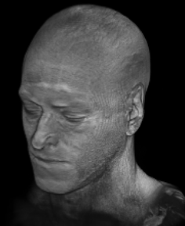

Convert a series of images into a gif animation.

# Installation

```bash
pip install gifmaker
```

# Usage

```bash
gifmaker -i IMAGE1.png IMAGE2.png
gifmaker -i *.png
```

Note: all images mush have the same size.

For more features, run:
~~~
gifmaker -h
~~~

# License

see [LICENSE](../LICENSE)
